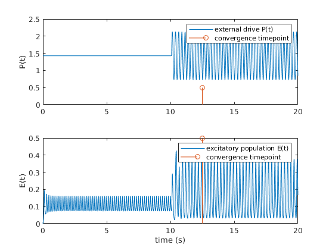
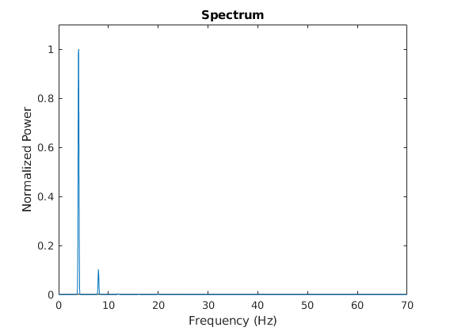

# Entrainment2019

Theoretical investigation of the effect of divisive inhibition on entrainment

This is the readme for the paper:

Papasavvas CA, Trevelyan AJ, Kaiser M, Wang Y (2020) Divisive gain
modulation enables flexible and rapid entrainment in a neocortical
microcircuit model. J Neurophysiol 123:1133-1143

This model was contributed by C Papasavvas.

Use the script entrainmentDemo to manipulate the parameters (initial phase diff., amplitude, frequency, and divisiveness parameter) and run the simulation.

The script calls the function solverODEreduc which collects all the parameters and runs the enrtainment scenario/simulation.

The solverODEreduc function calls the modelFunqVarInput which describes the model.

The freq_analys function is called after the simulation for the spectral analysis of the generated signal.

The entrainmentDemo in its default state produces the following graphs:

if the phase is changed to 0 in the entrainmentDemo.m file then a graph that corresponds to Fig3A is produced

